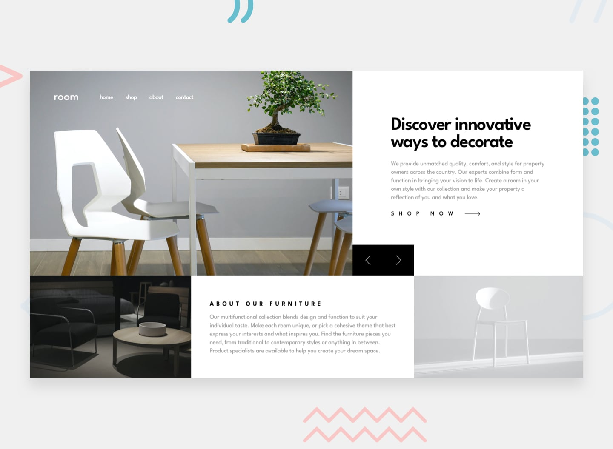

# Frontend Mentor - Room Homepage

A responsive furniture landing page built as a solution to the [Frontend Mentor Room homepage challenge](https://www.frontendmentor.io/challenges/room-homepage-BtdBY_ENq).



## Table of Contents

- [Overview](#overview)
- [Links](#links)
- [Features](#features)
- [Built With](#built-with)
- [Getting Started](#getting-started)
- [Project Structure](#project-structure)
- [Accessibility](#accessibility)
- [What I Learned](#what-i-learned)
- [Continued Development](#continued-development)
- [Useful Resources](#useful-resources)
- [AI Collaboration](#ai-collaboration)
- [Author](#author)
- [Acknowledgments](#acknowledgments)

## Overview

This project recreates the Room furniture landing page. It includes a responsive hero carousel, a mobile navigation menu, and an about section with furniture photography.

## Links

- Live site: [room-homepage-repro.vercel.app](https://room-homepage-repro.vercel.app/)
- Frontend Mentor solution: [Room homepage solution](https://www.frontendmentor.io/solutions/room-home-page-j0pOWElF8s)
- Source code: [repro123/room-homepage](https://github.com/repro123/room-homepage)

## Features

- Responsive layouts and hero images for mobile and desktop.
- Three-slide hero carousel with previous and next controls and wraparound navigation.
- Carousel keyboard controls: Enter and Space activate the focused buttons; left and right arrows change slides while a control is focused.
- Screen-reader labels for carousel controls and a live announcement of the active slide.
- Responsive navigation with a toggleable mobile menu.

## Built With

- React 19
- TypeScript
- Vite
- Tailwind CSS 4
- Lucide React
- Semantic HTML and responsive image markup

## Getting Started

### Prerequisites

- Node.js
- pnpm

### Install and run locally

```sh
pnpm install
pnpm dev
```

Vite prints the local development URL in the terminal after the server starts.

### Available scripts

```sh
pnpm dev      # Start the development server
pnpm build    # Type-check and create a production build
pnpm lint     # Run ESLint
pnpm preview  # Preview the production build locally
```

## Project Structure

- `src/components/SectionOne.tsx` - Hero content, responsive image, and carousel controls.
- `src/components/Picture.tsx` - Reusable `<picture>` component with a 768px source breakpoint.
- `src/components/Header.tsx` and `src/components/Logo.tsx` - Site branding and responsive navigation.
- `src/components/SectionTwo.tsx` - About section composition.
- `src/lib/data.ts` - Navigation labels and typed hero slide content.
- `public/preview.jpg` - Screenshot shown above.

## Accessibility

Carousel controls are native buttons with the accessible names "Previous slide" and "Next slide". They support built-in Enter and Space activation, as well as left and right arrow keys while focused. A polite live region announces the active slide. The mobile navigation toggle has an accessible name and exposes its expanded state with `aria-expanded`.

## What I Learned

- The native `<picture>` element can select mobile or desktop image sources at a media breakpoint while retaining an `` fallback.
- Storing the active slide index makes it straightforward to navigate the slide array and wrap at either end.
- Native buttons provide keyboard activation; clear accessible names and a live region communicate controls and slide changes to assistive technology.

## Continued Development

- Replace the placeholder `#` destinations in the navigation and shop link with real page destinations.
- Continue comparing mobile and desktop layouts against the challenge designs and refine spacing and focus states where needed.
- Add automated interaction tests for carousel keyboard controls and mobile menu behavior.

## Useful Resources

- [MDN: The `<picture>` element](https://developer.mozilla.org/en-US/docs/Web/HTML/Element/picture) - Reference for responsive image source selection.
- [React: State as a snapshot](https://react.dev/learn/state-as-a-snapshot) - Explains how React state updates drive rendered content.
- [WAI-ARIA Authoring Practices: Carousel Pattern](https://www.w3.org/WAI/ARIA/apg/patterns/carousel/) - Guidance for accessible carousel controls and announcements.

## AI Collaboration

GitHub Copilot was used for implementation guidance, code review, and checking the carousel's keyboard and accessible-name behavior. The production build and browser interactions were tested during development.

## Author

- GitHub: [@repro123](https://github.com/repro123)
- Frontend Mentor: [Room homepage solution](https://www.frontendmentor.io/solutions/room-home-page-j0pOWElF8s)

## Acknowledgments

- [Frontend Mentor](https://www.frontendmentor.io/) for the Room homepage challenge and design assets.
